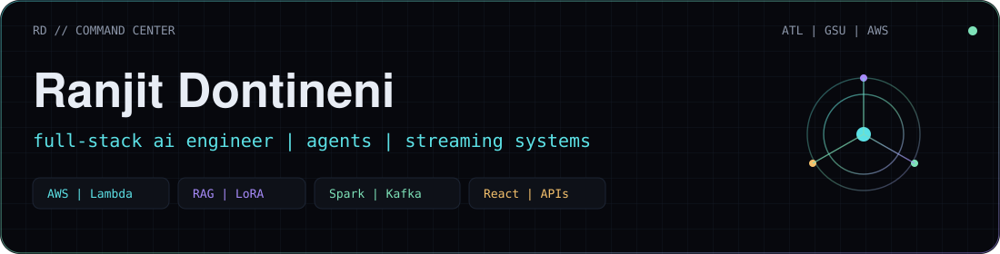
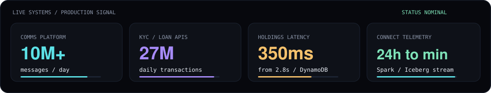
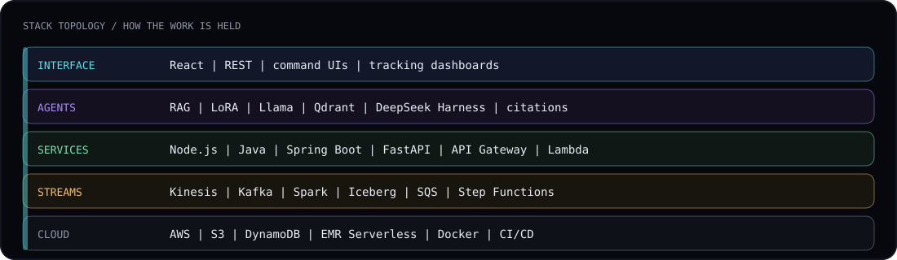

<div align="center">



**Full-stack AI engineer** building cloud services, streaming data, and agents that stay grounded in sources.

Atlanta · MS CS @ Georgia State · SDE Intern @ AWS Connect · previously SDE I @ Aditya Birla Capital

[Command Center](https://ranjitdontineni09.github.io) · [LinkedIn](https://www.linkedin.com/in/ranjit-dontineni-767399216/) · [ranjitd.com](https://ranjitd.com) · [Email](mailto:ranjitdontineni9@gmail.com)

</div>

---

### Live production signal



### How the stack is held



### Systems in motion


<p align="center">
  <a href="https://ranjitdontineni09.github.io"><strong>Open the interactive dashboards ? inspect pipelines, stack, and timeline</strong></a>
</p>

---

### What I ship

| Surface | What it is | Proof |
| --- | --- | --- |
| **Connect stream** | Near-real-time Amazon Connect telemetry on Lambda, SQS, Kinesis, Spark, Iceberg | Freshness **24h ? minutes** for forecasting, ML, and AI-agent workflows |
| **BizTalk ? AWS** | 8+ services / 12 Lambdas, submit–poll–webhook APIs | **99.9%** availability · **27M** daily loan & KYC txs |
| **Holdings cache** | DynamoDB read-through + Step Functions refresh | **2.8s ? 350ms** |
| **Comms platform** | WhatsApp / SMS / email journeys on API Gateway + Lambda | **10M+** messages/day · **42%** faster delivery |
| **RAG agent** | FastAPI + Llama LoRA + Qdrant + React, refuse when retrieval is empty | Answers stay cited to sources |
| **Kafka task mesh** | Java / Spring Boot workers, REST tracking UI | Async parallel jobs with a visible lifecycle |

---

### Runtime

```text
languages   Java · TypeScript · Python · SQL · C#
backend     Node.js · Spring Boot · FastAPI · REST · event-driven
cloud       AWS Lambda · API Gateway · SQS · Kinesis · EMR · DynamoDB · S3
data        Spark · Iceberg · Kafka · PostgreSQL · Redis · Qdrant
ai          Llama · LoRA · RAG · PyTorch · Hugging Face · DeepSeek Harness
frontend    React · command UIs · tracking dashboards
```

<p align="center">
  
</p>

---

### Now

MS Computer Science at Georgia State (2025–2027). Previously two years shipping production AWS at Aditya Birla Capital. Summer 2026 on Amazon Connect streaming. Open to **full-time SDE / full-stack AI** roles.

<p align="center">
  <a href="https://calendly.com/ranjitdontineni9/30min">Schedule a conversation</a>
  ·
  <a href="mailto:ranjitdontineni9@gmail.com">ranjitdontineni9@gmail.com</a>
</p>
